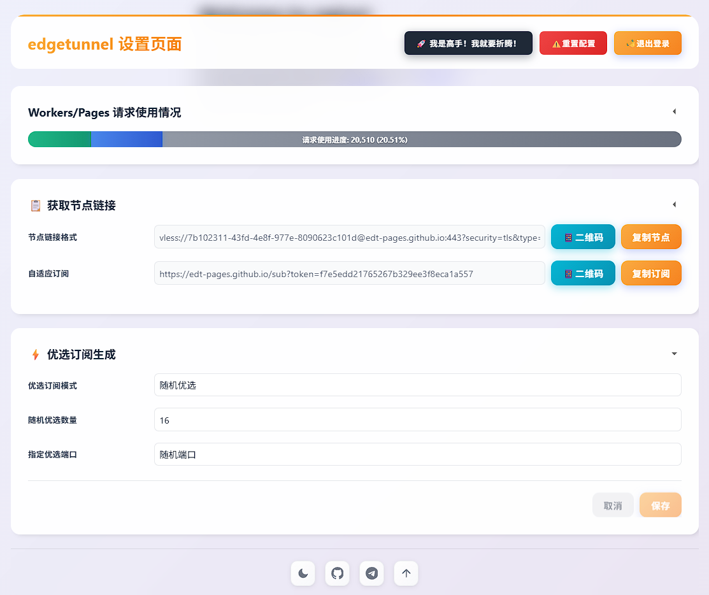

# 🚀 edgetunnel 2.0 — نسخهٔ فارسی‌شده

> این نسخه، fork شخصی‌سازی‌شدهٔ [cmliu/edgetunnel](https://github.com/cmliu/edgetunnel) است؛ یک تونل VLESS/Trojan مبتنی بر Cloudflare Workers/Pages همراه با پنل مدیریت فارسی و چند بهینه‌سازی برای سرعت و تأخیر.



---

## ✨ چه چیزی در این نسخه تغییر کرده است؟

| بخش | تغییر |
| :--- | :--- |
| 🎨 **پنل مدیریت فارسی** | کل پنل (`/admin`) و صفحهٔ ورود (`/login`) به فارسی ترجمه و برای **راست‌به‌چپ (RTL)** تنظیم شده‌اند؛ فونت فارسی (Vazirmatn با جایگزین Tahoma) اعمال شده است. |
| 🚫 **حذف محدودیت جغرافیایی ایران** | نسخهٔ بالادست کاربران ایرانی را شناسایی و پس از چند ثانیه به پروژهٔ دیگری هدایت می‌کرد؛ این محدودیت از صفحهٔ ورود حذف شد و ورود برای همه باز است. |
| 📦 **پنل خودمیزبان** | سورس کامل پنل در پوشهٔ `panel/` قرار دارد؛ با متغیر `PANEL` می‌توانید آن را روی دامنه/Pages خودتان سرو کنید (دیگر وابسته به میزبان بالادست نیستید). |
| ⚡ **کش پنل در لبه (Edge)** | صفحه‌های پنل که قبلاً در هر بار باز شدن از سرور دیگری fetch می‌شدند، حالا با Cache API کلادفلر (تا ۱۰ دقیقه) کش می‌شوند؛ تأخیر باز شدن پنل و مصرف Worker کاهش می‌یابد. |
| ⚡ **کش پیکربندی KV** | خواندن `config.json` از KV (که در هر درخواست سابسکریپشن و پنل انجام می‌شد) حالا تا ۳۰ ثانیه در حافظهٔ Worker کش می‌شود؛ سرعت تولید سابسکریپشن و پنل بالاتر می‌رود. پس از هر ذخیره در پنل، کش همان لحظه invalidate می‌شود. |
| 🔤 **متن‌های خطا به فارسی** | پیام‌های خطا/موفقیت API که در پنل نمایش داده می‌شوند (ذخیرهٔ پیکربندی، بازنشانی، بررسی پروکسی و...) به فارسی ترجمه شده‌اند. |
| 📖 **مستندات فارسی** | همین فایل + توضیح فنی ابزارهای شخصی‌سازی در انتها. |
| ⏸️ **توقف سینک خودکار** | workflow سینک روزانه با بالادست غیرفعال شد تا تغییرات شما با هر بار سینک پاک نشود. |

> 🕵️ **توجه:** دو صفحهٔ «جعل» (صفحهٔ خطای Cloudflare 1101 و صفحهٔ nginx) عمداً **به زبان اصلی (انگلیسی) نگه داشته شده‌اند** تا نقش استتار خود را حفظ کنند؛ اگر بخواهید آن‌ها هم فارسی شوند، می‌توانید انجام دهیم.

---

## 🧩 ساختار پروژه

```
├── _worker.js                  # کل Worker (تونل + پنل + API)
├── wrangler.toml               # پیکربندی محلی (اختیاری)
├── panel/                      # پنل مدیریت فارسی (سایت استاتیک)
│   ├── index.html              # صفحهٔ اول: انتقال به /login
│   ├── login/index.html        # صفحهٔ ورود فارسی (RTL)
│   ├── admin/index.html        # پنل مدیریت فارسی (RTL) — ساخته‌شده با ابزار
│   ├── noADMIN/index.html      # وقتی متغیر ADMIN تنظیم نشده
│   └── noKV/index.html         # وقتی KV متصل نشده
├── tools/                      # ابزار ساخت و ترجمهٔ پنل
│   ├── build_fa_panel.py       # اسکریپت ساخت پنل فارسی
│   ├── fa_panel/fa_dict.py     # دیکشنری ترجمه
│   └── upstream-panel.zip      # سورس اصلی پنل
├── README.md / README.fa.md
└── LICENSE
```

---

## 💡 استقرار

### Workers
1. یک Worker جدید بسازید و محتوای `_worker.js` را قرار دهید.
2. متغیر `ADMIN` (رمز عبور مدیر) را تنظیم کنید.
3. یک KV Namespace با نام دقیق `KV` بایند کنید.
4. دامنه سفارشی اضافه کنید و به `/admin` بروید.

### Pages
1. این ریپو را به CF Pages متصل کنید یا zip آپلود کنید.
2. متغیر `ADMIN` را تنظیم کنید.
3. KV با نام `KV` بایند کنید.
4. دامنه سفارشی تنظیم کنید.

---

## 🛠️ توسعه و شخصی‌سازی پنل

```bash
# افزودن/اصلاح ترجمه‌ها در:
#   tools/fa_panel/fa_dict.py
# سپس ساخت دوباره:
python tools/build_fa_panel.py
```

- ورودی: `tools/upstream-panel.zip`
- خروجی: `panel/admin/index.html`

---

## ⚠️ نکات امنیتی

- این پروژه برای آموزش و استفاده شخصی است.
- رمز `ADMIN` را قوی انتخاب کنید.
- پس از آزمایش، استقرار را حذف کنید.

---

## 🆘 عیب‌یابی سریع

| مشکل | راه‌حل |
| :--- | :--- |
| صفحهٔ «noADMIN» | متغیر `ADMIN` را تنظیم کنید. |
| صفحهٔ «noKV» | فضای نام KV با نام `KV` بسازید. |
| خطای 1101 | لاگ‌های Worker را در داشبورد ببینید. |
| پنل چینی می‌بینید | متغیر `PANEL` را به آدرس پنل فارسی خود تنظیم کنید. |

Upstream: [cmliu/edgetunnel](https://github.com/cmliu/edgetunnel)
